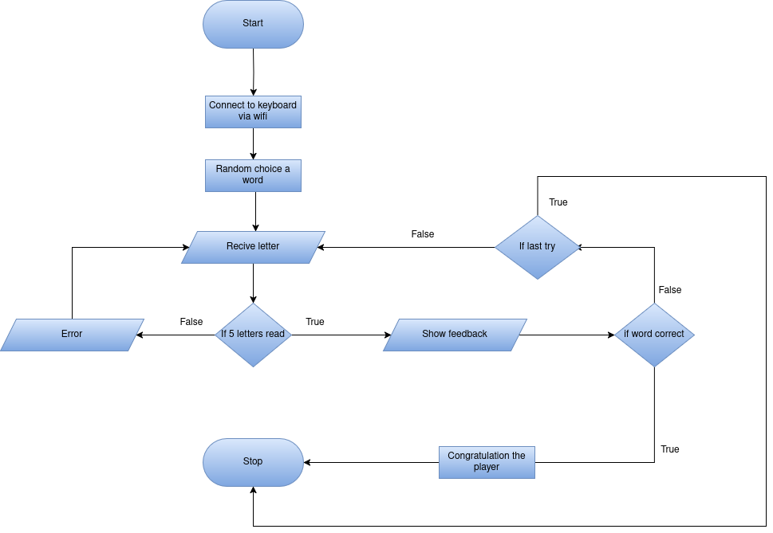

# Pico-Wordle
-------------------------------
### Content:
Project/

├── Code

├── Keyboard

├── Schematics

└── README.md

This repository contain the sourse code of a simple wordle game writen in Rust for 
Raspberry Pi Pico 2. The actual code is in the `Code` folder, the virtual keyboard code
used for the game is in the `Keyboard` folder, and the hardware schematics used 
to run the game is in the `Schematics` folder.

-------------------------------
### Code
In the `Code` folder you will find the source code of the game. The code is written in Rust and 
uses the **embassy** framework to build the game. The inputs letters are gived by a virtual keyboard via Wifi,
The code first init all the peripherals, then init the wifi and wait to be conected by the keyboard. 
Once the keyboard is conected, the game starts and the user can play the game.The user can enter the letter, 
or to delete the letter .When he complet the 5 letter word , he can press enter to check the word.
The feedback is given at the matrix ,if the led is on it means the position is correct, if the led blink 
it means is present but in the wrong position. The game is over when the user find the word or 
when he run out of tries.

-------------------------------

### Keyboard
In the `Keyboard` folder you will find the source code of the virtual keyboard. The keyboard is a simple 
GUI aplication using the **egui** framework for UI and **tokio** for async operations. The code first tries to connect 
to the Pico via Wifi, using the IP address and port specified in the code.
Once the connection is established, the user can enter the letters and send them to the Pico or 
he can delete the letter or submit the word.

-------------------------------

### Schematics
In the `Schematics` folder you will find the hardware schematics used to run the game. The format is .sch 
and has all the components used to run the game and how they are connected.

-------------------------------
### Diagram

### Links
- [Documentation](https://pmrust.pages.upb.ro/docs/acs_cc/project/2025/ianos.iudenco)
- [tokio crate](https://github.com/tokio-rs/tokio)
- [egui crate](https://github.com/emilk/egui)
